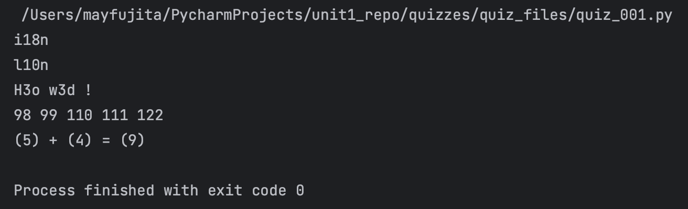

# Quiz 001
<hr>

## Prompt

*fig. 1* **Screenshot of quiz slides**

## Flow Diagram

*fig. 2* **Flow diagram of solution**

## Solution
```.py
def black_box(user_input: str) -> str:
    strings = user_input.split(' ')
    output = ''

    for word in strings:
        if len(word) <= 2:
            output += word + ' '
        else:
            output += word[0] + str(len(word) - 2) + word[-1] + ' '

    return output


# Check if it works:
print(black_box('internationalization'))
print(black_box('localization'))
print(black_box('Hello world !'))
print(black_box('98 99 100 101 1062'))
print(black_box('(codin) + (game) = (codingame)'))
```

## Evidence

*fig. 3* **Screenshot of output in console**