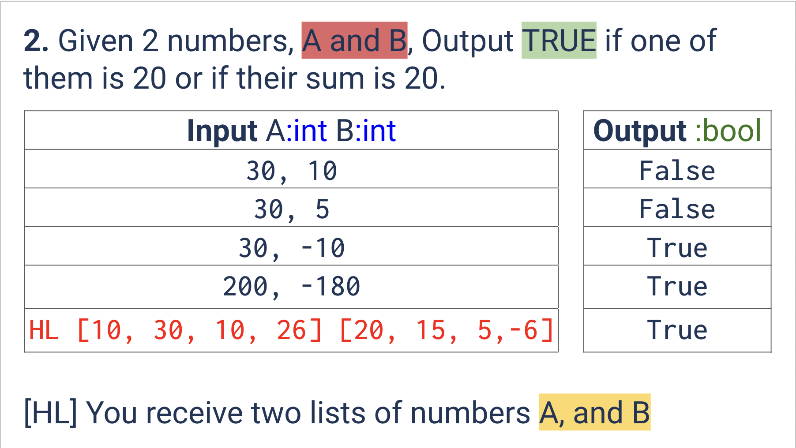
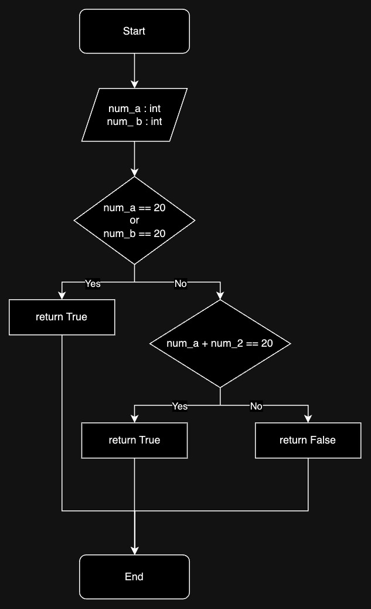
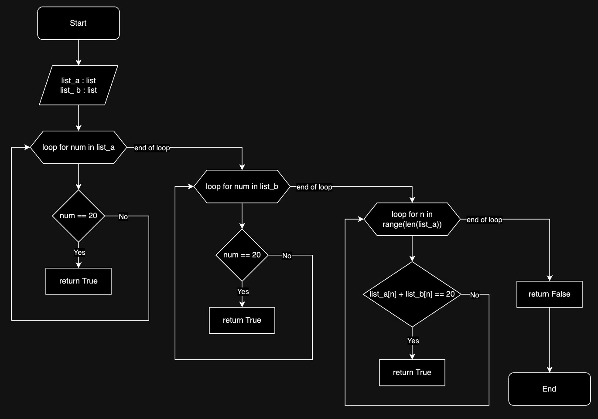

# Quiz 002
<hr>

### Prompt

*fig. 1* **Screenshot of quiz slides**

### Flow Diagram

*fig. 2* **Flow diagram of SL solution**

*fig. 3* **Flow diagram of HL solution**

### Solution
```.py
# SL
def check_20_sl(num1: int, num2: int) -> bool:
    if num1 == 20 or num2 == 20:
        return True
    elif num1 + num2 == 20:
        return True
    else:
        return False


# Check if it works:
print('SL check:', check_20_sl(num1=30, num2=10))


# HL
def check_20_hl(list1: list, list2: list) -> bool:
    for item in list1:
        if item == 20:
            return True
    for item in list2:
        if item == 20:
            return True
    for n in range(len(list1)):
        if list1[n] + list2[n] == 20:
            return True
    return False


# Check if it works:
print('HL check:', check_20_hl(list1=[10, 30, 10, 26], list2=[20, 15, 5, -6]))
```

### Evidence

*fig. 4* **Screenshot of output in console**