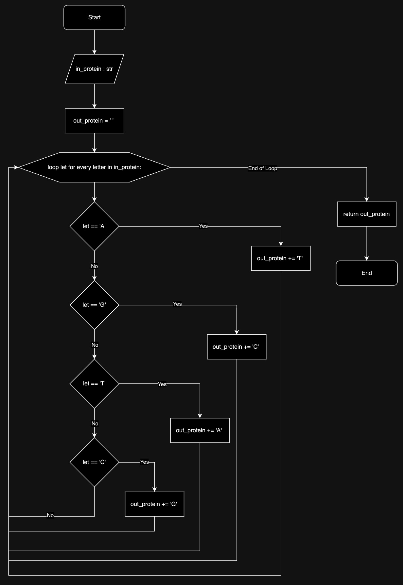
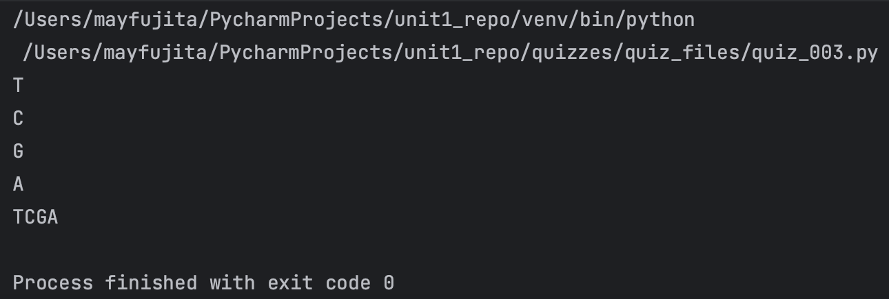

# Quiz 003
<hr>

### Prompt

*fig. 1* **Screenshot of quiz slides**

### Flow Diagram

*fig. 2* **Flow diagram of solution**

### Solution
```.py
def convert_protein(in_protein: str) -> str:
    out_protein = ''
    for letter in in_protein:
        if letter == 'A':
            out_protein += 'T'
        elif letter == 'G':
            out_protein += 'C'
        elif letter == 'T':
            out_protein += 'A'
        elif letter == 'C':
            out_protein += 'G'
        else:
            return "Error: unknown letter in protein string"
    return out_protein


# Check if it works:
print(convert_protein('A'))
print(convert_protein('G'))
print(convert_protein('C'))
print(convert_protein('T'))
print(convert_protein('AGCT'))
```

### Evidence

*fig. 3* **Screenshot of output in console**