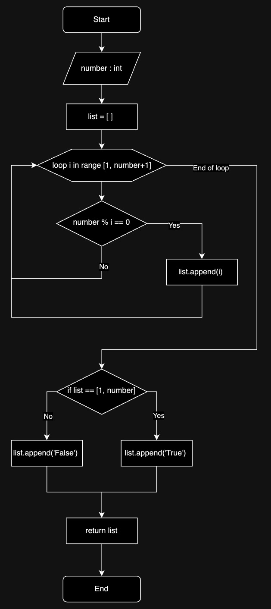

# Quiz 004
<hr>

### Prompt
<br>
*fig. 1* **Screenshot of quiz slides**

### Flow Diagram
<br>
*fig. 2* **Flow diagram of solution**

### Solution
```.py
def check_factors(number: int) -> list:
    factors = []
    for i in range(1,number+1):
        if number % i == 0:
            factors.append(i)
    if factors == [1, number]:
        factors.append('True')
    else:
        factors.append('False')
    return factors


# Check if function works:
print(check_factors(90))
print(check_factors(31))
```

### Evidence
<br>
*fig. 3* **Screenshot of output in console**