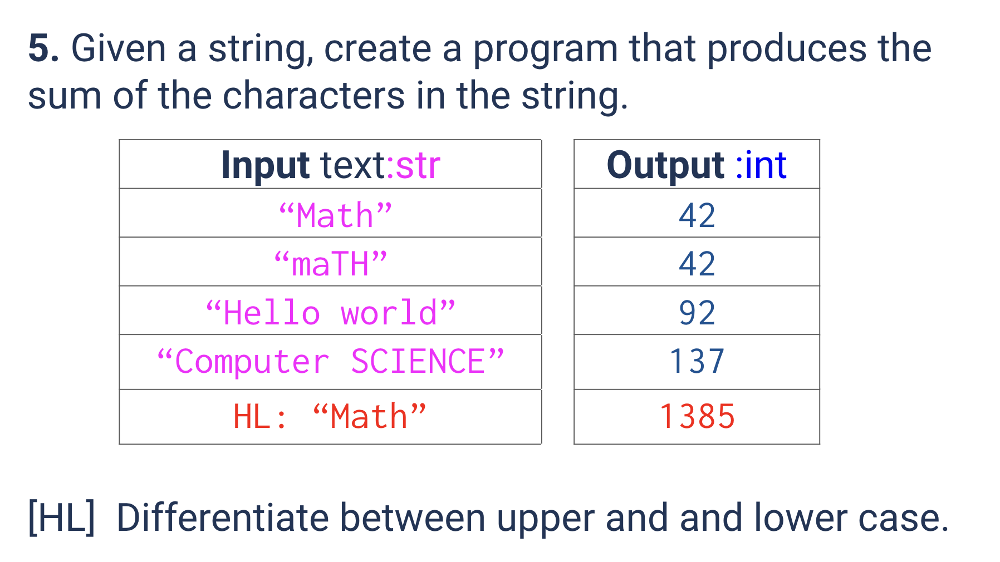
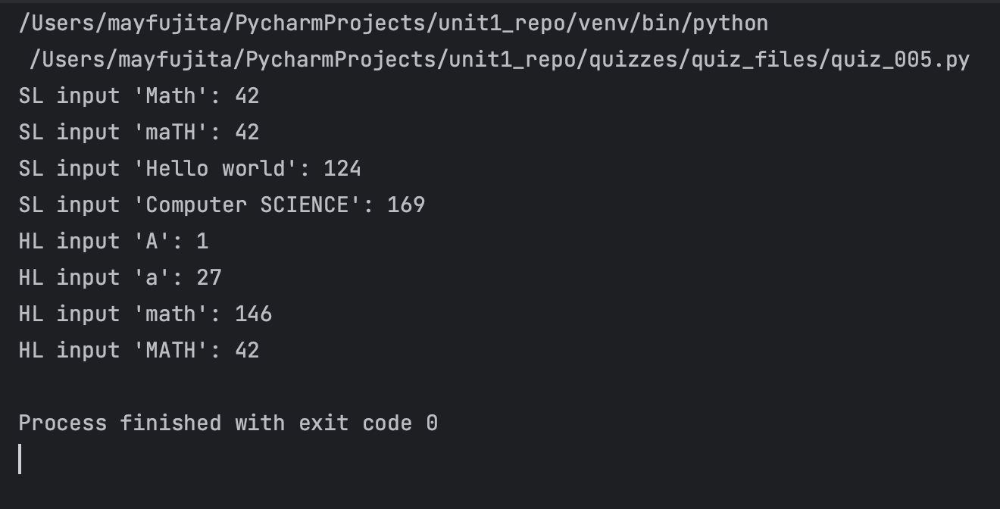

# Quiz 005
<hr>

### Prompt

*fig. 1* **Screenshot of quiz slides**

### Flow Diagram
*fig. 2* **Flow diagram of solution**

### Solution
```.py
# SL
def sum_letters_sl(text:str) -> int:
    total = 0
    for let in text:
        if let != ' ':
            total += (ord(let.lower())-96)
    return total


# Check that it works:
print("SL input 'Math':", sum_letters_sl(text='Math'))
print("SL input 'maTH':", sum_letters_sl(text='maTH'))
print("SL input 'Hello world':", sum_letters_sl(text='Hello world'))
print("SL input 'Computer SCIENCE':", sum_letters_sl(text='Computer SCIENCE'))


# HL
def sum_letters_hl(text:str) -> int:
    """
    as the output for Math in the_hl section on the quiz slides is likely not right,
in my code, I took capital 'A' as 1, and lowercase 'a' as 27, using the ASCII table.
    """
    sum_total = 0
    for let in text:
        if let.islower():
            sum_total += ord(let)-64-6
        if let.isupper():
            sum_total += ord(let)-64
    return sum_total


# Check that it works
print("HL input 'A':", sum_letters_hl(text='A'))
print("HL input 'a':", sum_letters_hl(text='a'))
print("HL input 'math':", sum_letters_hl(text='math'))
print("HL input 'MATH':", sum_letters_hl(text='MATH'))
```

### Evidence

*fig. 3* **Screenshot of output in console**