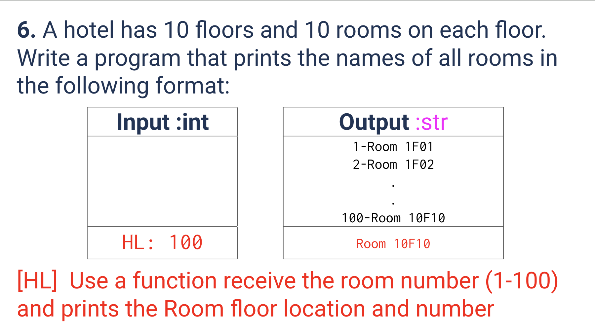
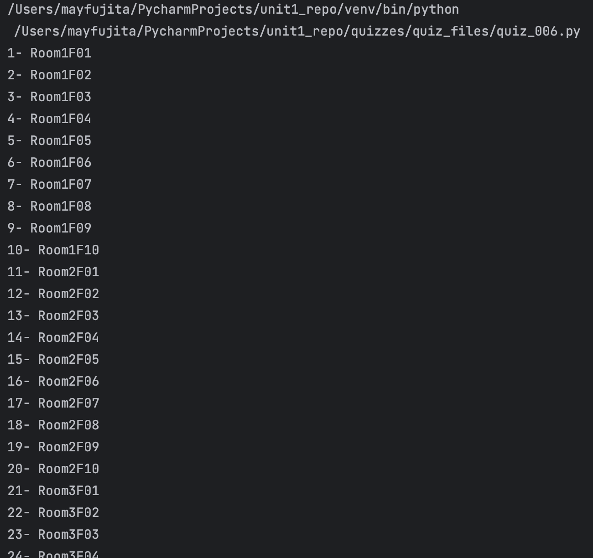
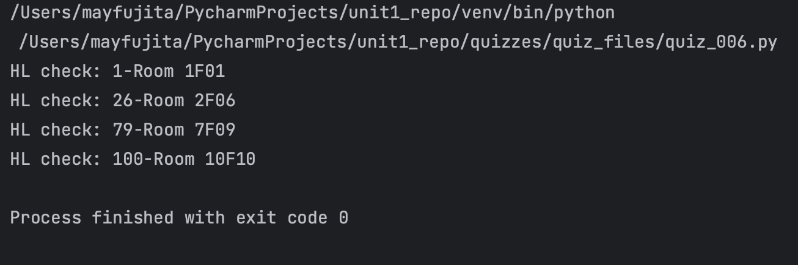

# Quiz 006
<hr>

### Prompt

*fig. 1* **Screenshot of quiz slides**

### Flow Diagram
*fig. 2* **Flow diagram of solution**

### Solution
```.py
# SL
count = 0
for f in range(1, 10+1):
    for r in range(1, 10+1):
        count += 1
        print(f'{count}- Room{f}F{r:02d}')


# HL
def locate_room(room_number: int) -> str:
    floor = room_number//10
    if floor == 0:
        floor = 1
    room = room_number%10
    if room == 0:
        room = 10
    return f'{room_number}-Room {floor}F{room:02d}'


# Check if it works:
print('HL check:', locate_room(1))
print('HL check:', locate_room(26))
print('HL check:', locate_room(79))
print('HL check:', locate_room(100))
```

### Evidence

*fig. 3* **Screenshot of output in console for SL solution**

*fig. 4* **Screenshot of output in console for HL solution**