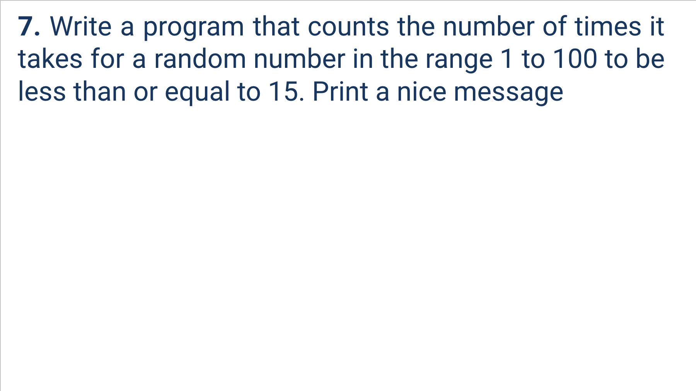
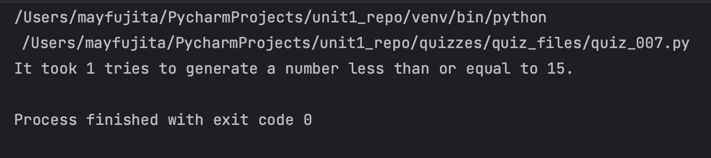

# Quiz 007
<hr>

### Prompt

*fig. 1* **Screenshot of quiz slides**

### Flow Diagram
*fig. 2* **Flow diagram of solution**

### Solution
```.py
import random

count = 0
n = random.randint(1, 100)

while n>15:
    count += 1
    n = random.randint(1, 100)
print(f"It took {count} tries to generate a number less than or equal to 15.")
```

### Evidence

*fig. 3* **Screenshot of output in console**