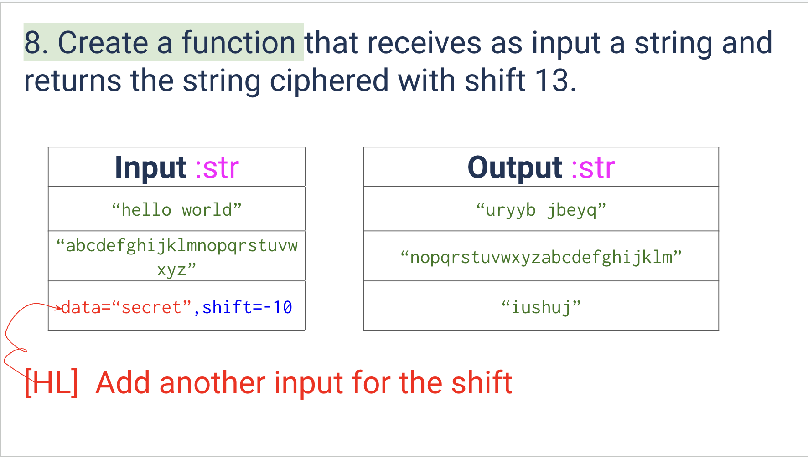
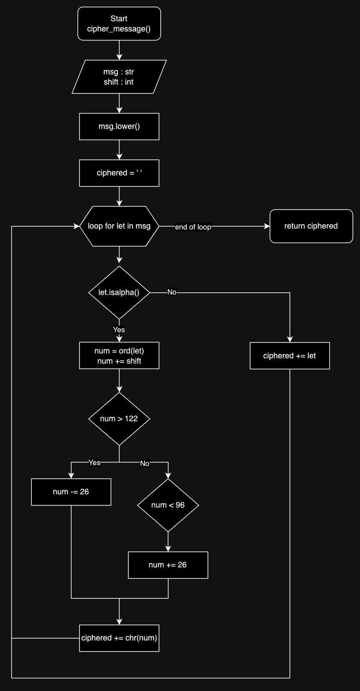
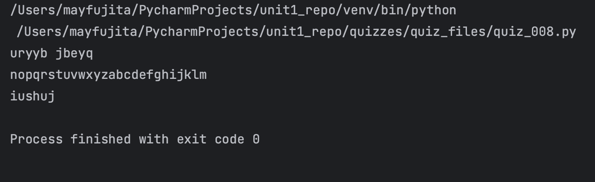

# Quiz 008
<hr>

### Prompt
<br>
*fig. 1* **Screenshot of quiz slides**

### Flow Diagram
<br>
*fig. 2* **Flow diagram of solution**

### Solution
```.py
def cipher_message(msg: str, shift: int) -> str:
    msg.lower()
    ciphered = ''

    for let in msg:
        if let.isalpha():
            num = ord(let)
            num += shift

            if num > 122:
                num -= 26
            elif num < 96:
                num += 26

            ciphered += chr(num)
        else:
            ciphered += let

    return ciphered


# Check that it works:
print(cipher_message(msg="hello world", shift=13))
print(cipher_message(msg="abcdefghijklmnopqrstuvwxyz", shift=13))
print(cipher_message(msg="secret", shift=-10))
```

### Evidence
<br>
*fig. 3* **Screenshot of output in console**
