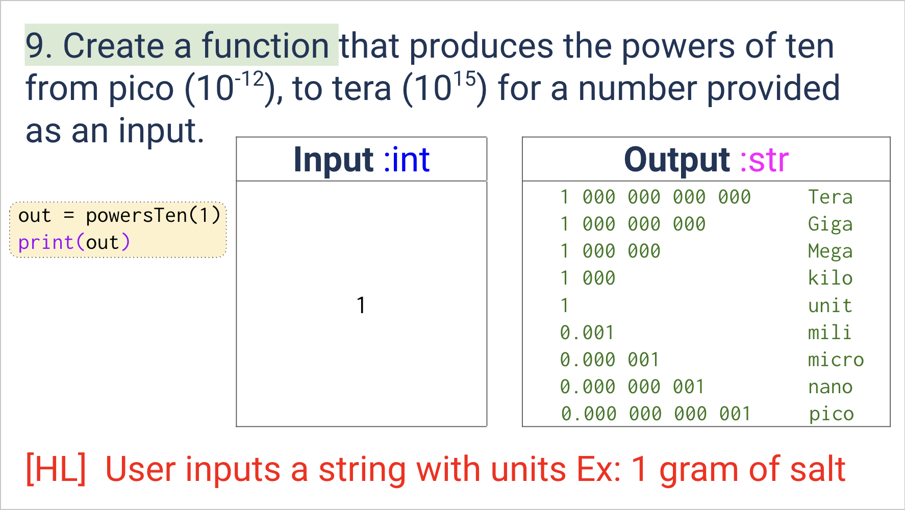

# Quiz 009
<hr>

### Prompt

*fig. 1* **Screenshot of quiz slides**

### Flow Diagram
*fig. 2* **Flow diagram of solution**

### Solution
```.py

```

### Evidence

*fig. 3* **Screenshot of output in console**