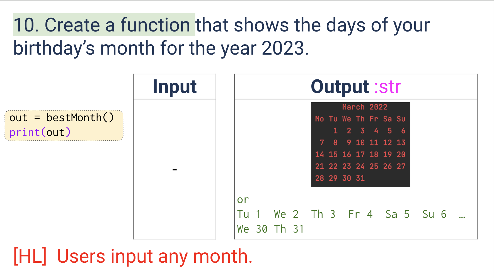
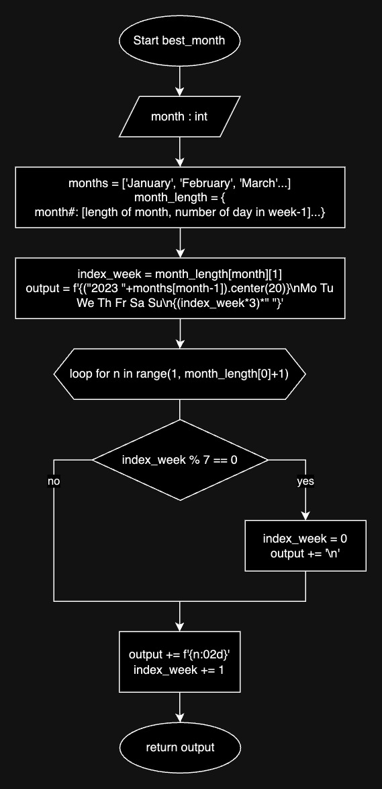
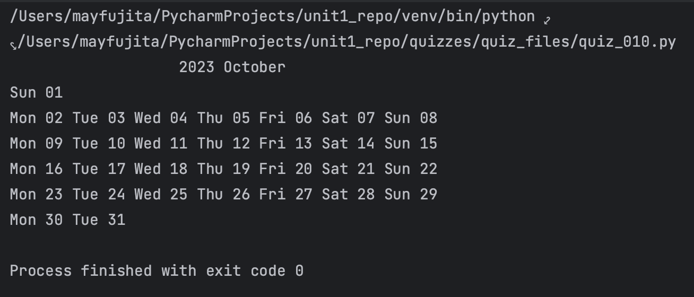

# Quiz 010
<hr>

### Prompt

*fig. 1* **Screenshot of quiz slides**

### Flow Diagram

*fig. 2* **Flow diagram of solution**

### Solution
```.py
def bestmonth(month: int) -> str:
    months = ['January', 'February', 'March', 'April', 'May', 'June', 'July', 'August', 'September', 'October', 'November', 'December']
    month_length = {
        1: [31, 6],
        2: [28, 2],
        3: [31, 2],
        4: [30, 5],
        5: [31, 0],
        6: [30, 3],
        7: [31, 5],
        8: [31, 1],
        9: [30, 4],
        10: [31, 6],
        11: [30, 2],
        12: [31, 4]}
    index_week = month_length[month][1]
    output = f'{("2023 "+months[month-1]).center(20)}\nMo Tu We Th Fr Sa Su\n{(index_week*3)*" "}'
    for n in range(1, month_length[month][0]+1):
        if index_week % 7 == 0:
            index_week = 0
            output += '\n'
        output += f'{n:02d} '
        index_week += 1
    return output

# Check that it works:
print(bestmonth(month=10))
```

### Evidence

*fig. 3* **Screenshot of output in console**
