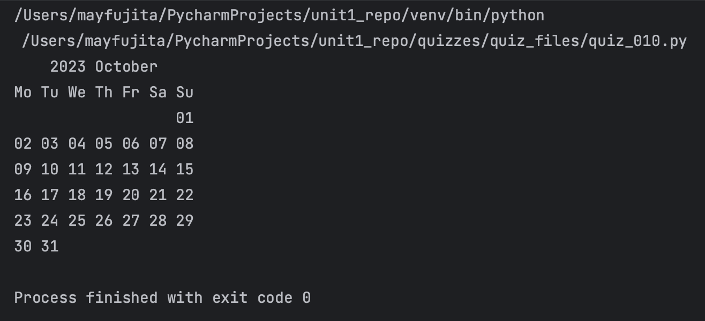

# Quiz 010
<hr>

### Prompt

*fig. 1* **Screenshot of quiz slides**

### Flow Diagram

*fig. 2* **Flow diagram of solution**

### Solution
```.py
def bestmonth(month: int) -> str:
    weekdays = ['Mon', 'Tue', 'Wed', 'Thu', 'Fri', 'Sat', 'Sun']
    months = ['January', 'February', 'March', 'April', 'May', 'June', 'July', 'August', 'September', 'October', 'November', 'December']
    month_length = {
        1: [31,'Sun'],
        2: [28, 'Wed'],
        3: [31, 'Wed'],
        4: [30, 'Sat'],
        5: [31, 'Mon'],
        6: [30, 'Thu'],
        7: [31, 'Sat'],
        8: [31, 'Tue'],
        9: [30, 'Fri'],
        10: [31, 'Sun'],
        11: [30, 'Wed'],
        12: [31, 'Fri']}
    start_week = month_length[month][1]
    index_week = weekdays.index(start_week)
    output = ''
    output += f'{months[month-1]}'.center(50) + '\n'
    for n in range(1, month_length[month][0]+1):
        if index_week % 7 == 0:
            index_week = 0
            output += '\n'
        output += f'{weekdays[index_week]} {n:02d} '
        index_week += 1

    return output

# Check that it works:
print(bestmonth(month=10))
```

### Evidence

*fig. 3* **Screenshot of output in console**