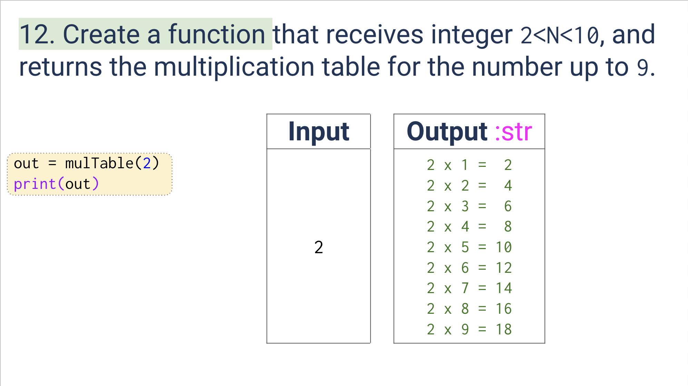
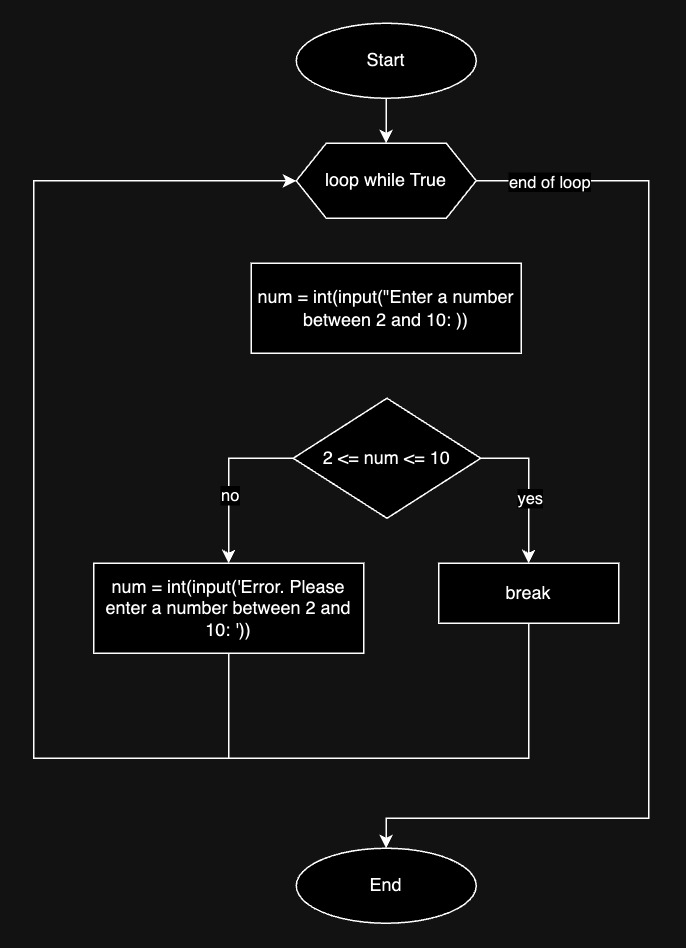
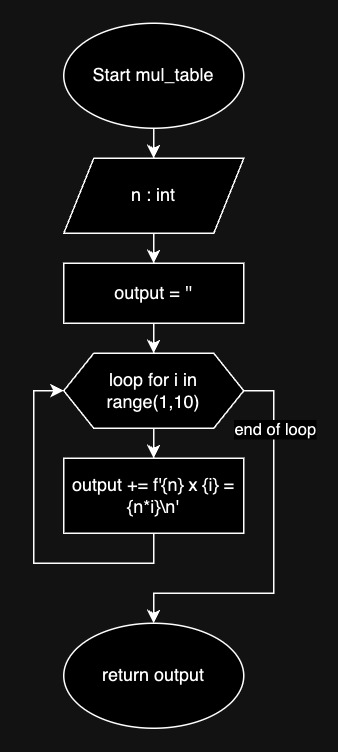

# Quiz 011
<hr>

### Prompt

*fig. 1* **Screenshot of quiz slides**

### Flow Diagram

*fig. 2* **Flow diagram of validation of user input**


*fig. 3* **Flow diagram of solution**

### Solution
```.py
while True:
    number = int(input('Enter a number between 2 and 10: '))
    if 2 <= number <= 10:
        break
    else:
        number = int(input('Error. Please enter a number between 2 and 10: '))


def mul_table(n: int) -> str:
    output = ''
    for i in range(1,10):
        output += f'{n} x {i} = {n*i}\n'
    return output


print(mul_table(n=number))
```

### Evidence

*fig. 4* **Screenshot of output in console**
