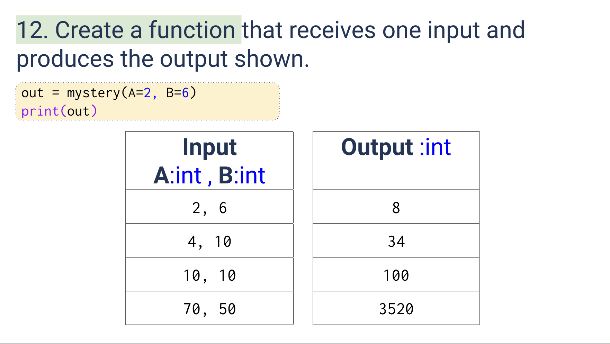
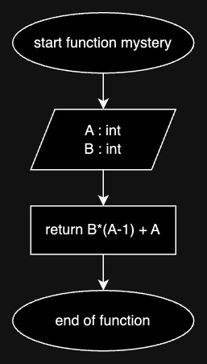
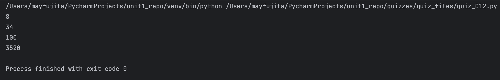

# Quiz 012
<hr>

### Prompt

*fig. 1* **Screenshot of quiz slides**

### Flow Diagram

*fig. 2* **Flow diagram of solution**

### Solution
```.py
def mystery(A: int, B: int) -> int:
    return B*(A-1) + A

# Check if it works:
print(mystery(A=2, B=6))
print(mystery(A=4, B=10))
print(mystery(A=10, B=10))
print(mystery(A=70, B=50))
```

### Evidence

*fig. 3* **Screenshot of output in console**