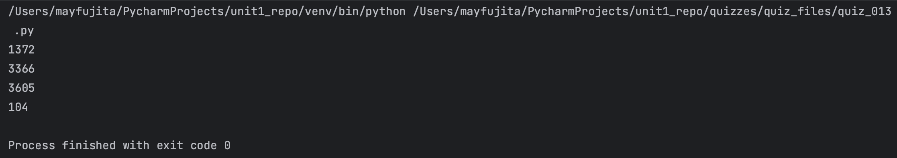

# Quiz 013
<hr>

### Prompt
**Slide for this quiz no longer exists???**

### Flow Diagram

*fig. 2* **Flow diagram of solution**

### Solution
```.py
def mysteryTwo(A: int, B: int) -> int:
    return A**2 + B

# Check that it works:
print(mysteryTwo(37, 3))
print(mysteryTwo(58, 2))
print(mysteryTwo(60, 5))
print(mysteryTwo(10, 4))
```

### Evidence

*fig. 3* **Screenshot of output in console**