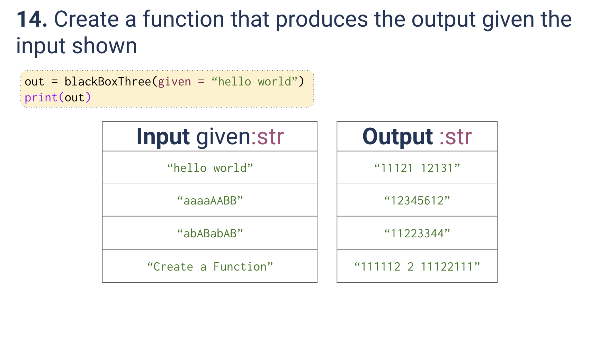
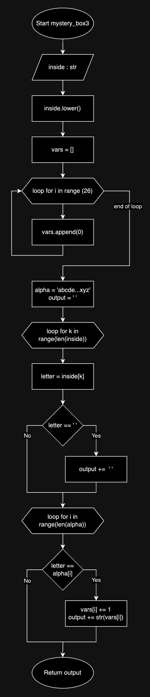

# Quiz 014
<hr>

### Prompt

*fig. 1* **Screenshot of quiz slides**

### Flow Diagram

*fig. 2* **Flow diagram of solution**

### Solution
```.py
def mystery_box3(inside:str) -> str:
    inside = inside.lower()
    vars = []
    for i in range(26):
        vars.append(0)
    alpha = 'abcdefghijklmnopqrstuvwxyz'
    output = ''
    for k in range(len(inside)):
        letter = inside[k]
        if letter == ' ':
            output += ' '
        for i in range (len(alpha)):
            if letter == alpha[i]:
                vars[i] += 1
                output += str(vars[i])
    return output


# Check that it works:
print(mystery_box3("hello world"))
print(mystery_box3("aaaaAABB"))
print(mystery_box3("abABabAB"))
print(mystery_box3("Create a function"))
```

### Evidence

*fig. 3* **Screenshot of output in console**