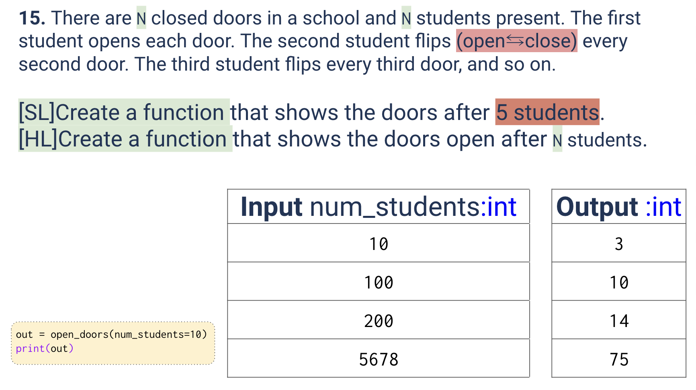
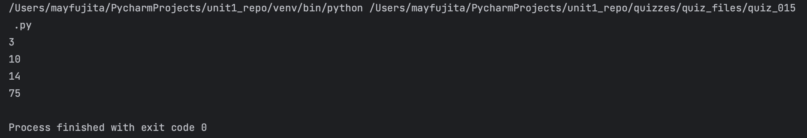

# Quiz 015
<hr>

### Prompt

*fig. 1* **Screenshot of quiz slides**

### Flow Diagram

*fig. 2* **Flow diagram of solution**

### Solution
```.py
def mystery_doors(num_students):
    doors = []
    for n in range(num_students):
        doors.append(False)
    for stu in range(num_students):
        for d in range(stu, num_students, stu+1):
            doors[d] = not doors[d]
    return doors.count(True)

# Check that it works:
print(mystery_doors(10))
print(mystery_doors(100))
print(mystery_doors(200))
print(mystery_doors(5678))

```

### Evidence

*fig. 3* **Screenshot of output in console**