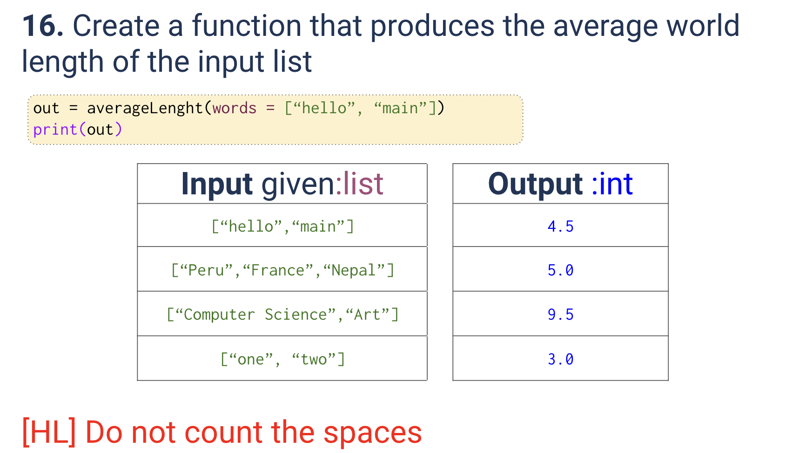
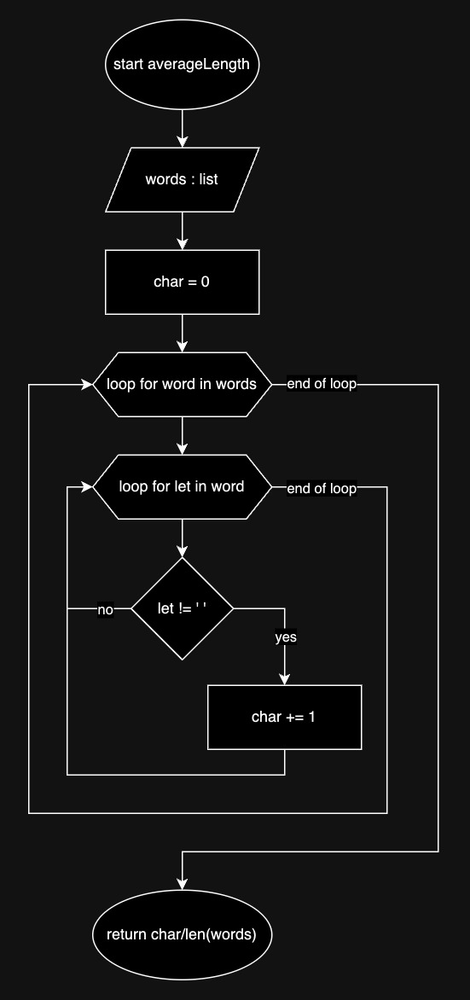
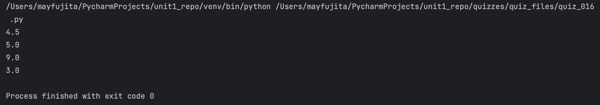

# Quiz 016
<hr>

### Prompt

*fig. 1* **Screenshot of quiz slides**

### Flow Diagram

*fig. 2* **Flow diagram of solution**

### Solution
```.py
def averageLength(words: list) -> float:
    char = 0
    for word in words:
        for l in word:
            if l != ' ':
                char += 1
    return char/len(words)

# Check that it works:
print(averageLength(["hello", "main"]))
print(averageLength(["Peru", "France", "Nepal"]))
print(averageLength(["computer science", "art"]))  # HL, therefore expected output should be 9
print(averageLength(["one", "two"]))
```

### Evidence

*fig. 3* **Screenshot of output in console**